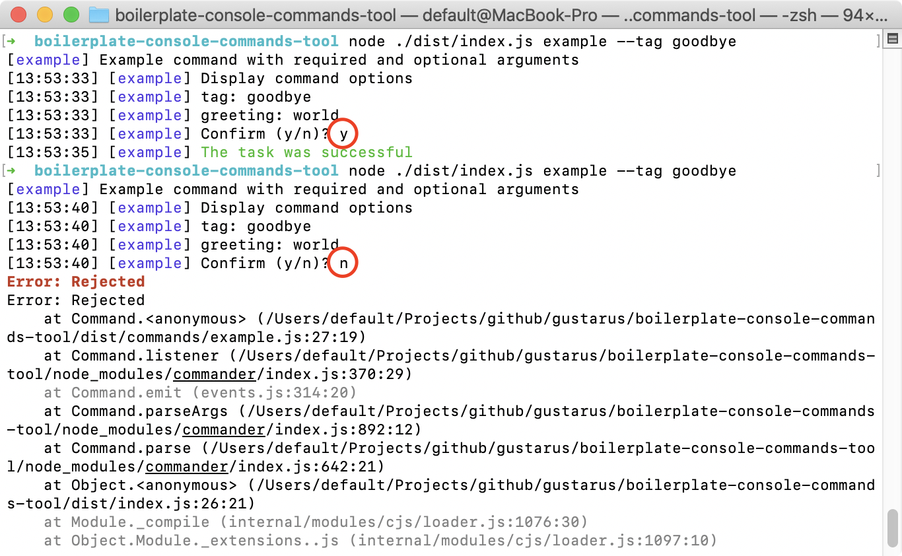

# Boilderplate for console commands tool
**Boilerplate to write console commands tool**.
Uses [commander npm](https://www.npmjs.com/package/commander) package to build console commands tool.

## Use the example command
**0. Clone the repository**
Use this repository as a template for your command tool.
```bash
git clone git@github.com:gustarus/boilerplate-console-commands-tool.git 
cd boilerplate-console-commands-tool
```

**1. Install packages**
Install as local package to link with `./node_modules/.bin`.
```bash
npm i
```

**2. Build the source code**
```bash
npm run build
```

**3. Run the help command**
```bash
node ./dist/index.js -h
```

**4. Run the example command**
```bash
node ./dist/index.js example --tag goodbye
```



## Create your own commands
Create files in the [src/commands](src/commands) folder and add them into [src/index.ts](src/index.ts) file to enable them.

## Run the boilerplate in watch mode
You can run the watch mode to rebuild the typescript code automatically.
```bash
npm run watch
```
